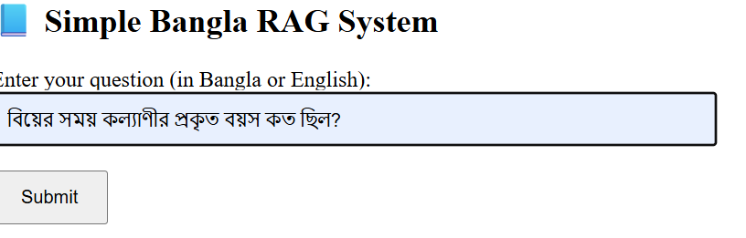
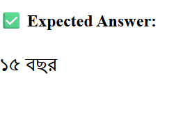
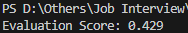

📘 Simple Multilingual RAG System (Bangla + English)
This is a basic Retrieval-Augmented Generation (RAG) system designed for answering Bangla and English questions from an HSC Bangla 1st Paper PDF. It uses PDF pre-processing, sentence-level chunking, vector search, and a web UI for user interaction.

✅ Objective
Build a system that:

Accepts user queries in English or Bangla.

Retrieves relevant information from a Bangla textbook PDF.

Returns meaningful answers based on retrieved document chunks.

📂 Project Structure
bash
Copy
Edit
├── data/
│   └── hsc26_bangla_1st_paper.pdf       # PDF Corpus
├── src/
│   └── preprocess.py                    # RAG pipeline + Web UI
    └── import pytest.py                  
├── requirements.txt
├── README.md
⚙️ Setup Guide
Clone the repository:

bash
Copy
Edit
git clone https://github.com/your-username/bangla-rag-system.git
cd bangla-rag-system
Install dependencies:

bash
Copy
Edit
pip install -r requirements.txt
Add your PDF file:

Place the hsc26_bangla_1st_paper.pdf inside the data/ directory.

Run the app:

bash
Copy
Edit
python src/preprocess.py
Now visit: http://localhost:7860

📌 Tools & Libraries Used
pdfplumber: PDF text extraction

transformers: Tokenizer from LaBSE model

Flask: Lightweight web UI

re: Sentence splitting and cleaning

💡 Sample Queries & Expected Output
User Query (Bangla)	Expected Answer
অনুপমের ভাষায় সুপুরুষ কাকে বলা হয়েছে?	শুম্ভুনাথ
কাকে অনুপমের ভাগ্য দেবতা বলে উল্লেখ করা হয়েছে?	মামাকে
বিয়ের সময় কল্যাণীর প্রকৃত বয়স কত ছিল?	১৫ বছর
🧠 Evaluation Matrix
